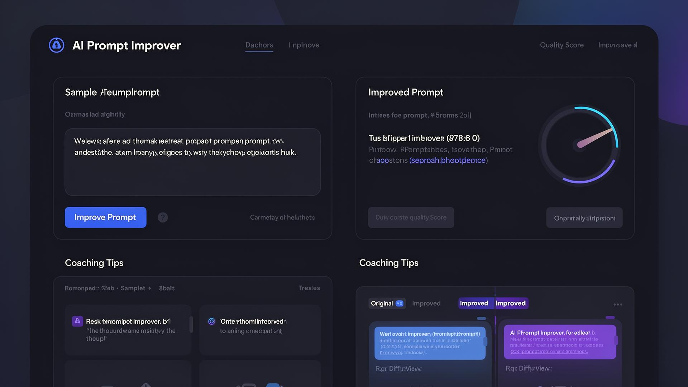

# 🧠 AI Prompt Improver

A powerful web application that helps you craft better AI prompts through intelligent analysis, real-time coaching, and data-driven recommendations.



## ✨ Features

### Prompt Enhancement
- **AI-Powered Improvements** — Automatically rewrite and enhance prompts with model-specific optimizations
- **Multi-Model Support** — Optimize for GPT-4, GPT-3.5 Turbo, Claude 3 (Opus/Sonnet/Haiku), Gemini Pro, and Llama 2
- **Quality Scoring** — Real-time quality analysis with actionable breakdown

### Prompt Coaching
- **Real-Time Tips** — Get contextual coaching tips (clarity, specificity, context, structure, constraints, examples) as you type
- **One-Click Apply** — Apply individual tips or all at once with AI-powered rewrites
- **Adaptive Prioritization** — Tips are ranked based on historical engagement data so the most useful categories surface first

### Prompt Diff & Version History
- **Side-by-Side Diff View** — Compare original and improved prompts with highlighted changes
- **Version History** — Browse, restore, and manage previous prompt iterations
- **Data Export/Import** — Backup and restore your prompt history

### Template Library
- **Built-In Templates** — Curated prompt templates across multiple categories
- **Custom Templates** — Create, edit, and manage your own reusable templates
- **AI-Powered Recommendations** — Get template suggestions based on your prompt content
- **Template Favorites** — Bookmark templates for quick access

### Analytics Dashboard
- **Usage Statistics** — Track total improvements, copy rate, favorite rate, and quality scores
- **Time-Series Trends** — Visualize prompt, category, model, and template usage over time with interactive charts
- **Coaching Tip Analytics** — Breakdown of tip types by application rate, priority distribution, and engagement
- **Most Applied Tips Leaderboard** — Ranked view of which coaching tip categories users find most valuable
- **Coaching Tip Trend Charts** — Volume and category breakdown of tip interactions over time
- **Milestone Notifications** — Celebrate usage milestones with toast notifications

### Sharing & Collaboration
- **Shareable Links** — Generate public links for improved prompts with optional expiration
- **View Counter** — Track how many times shared prompts have been viewed

### User Management
- **Authentication** — Email-based signup and login with session persistence
- **User Profiles** — Display name, bio, and avatar customization
- **Backup Codes** — Two-factor recovery code support
- **Dark/Light Mode** — System-aware theme toggle

## 🛠️ Tech Stack

| Layer | Technology |
|-------|-----------|
| **Framework** | React 18 + TypeScript |
| **Build Tool** | Vite |
| **Styling** | Tailwind CSS + tailwindcss-animate |
| **UI Components** | shadcn/ui (Radix UI primitives) |
| **Routing** | React Router DOM v6 |
| **State/Data** | TanStack React Query |
| **Backend** | Lovable Cloud (Supabase) — Auth, Database, Edge Functions |
| **AI Gateway** | Lovable AI (Gemini 2.5 Flash) |
| **Charts** | Recharts |
| **Icons** | Lucide React |
| **Theming** | next-themes |
| **Forms** | React Hook Form + Zod |
| **Date Utilities** | date-fns |
| **Notifications** | Sonner + Radix Toast |

## 🚀 Getting Started

### Prerequisites
- Node.js v16+

### Installation

```bash
git clone <YOUR_GIT_URL>
cd <YOUR_PROJECT_NAME>
npm install
npm run dev
```

Open [http://localhost:5173](http://localhost:5173) in your browser.

## 📖 How to Use

1. **Sign up / Log in** — Create an account to persist your data
2. **Browse Templates** — Pick a starting template or write your own prompt
3. **Improve** — Select an AI model and click "Improve Prompt"
4. **Coach** — Review real-time coaching tips and apply suggestions
5. **Compare** — Use the diff view to see exactly what changed
6. **Share** — Generate a shareable link for your improved prompt
7. **Analyze** — Visit the Analytics tab to track your usage patterns

## 📦 Scripts

| Command | Description |
|---------|-------------|
| `npm run dev` | Start development server |
| `npm run build` | Production build |
| `npm run preview` | Preview production build |
| `npm run lint` | Run ESLint |

## 🔗 Links

- **Live App**: [prompt-enhancer-grove-181.lovable.app](https://prompt-enhancer-grove-181.lovable.app)
- **Documentation**: [docs.lovable.dev](https://docs.lovable.dev/)

---

Built with ❤️ using [Lovable](https://lovable.dev)
