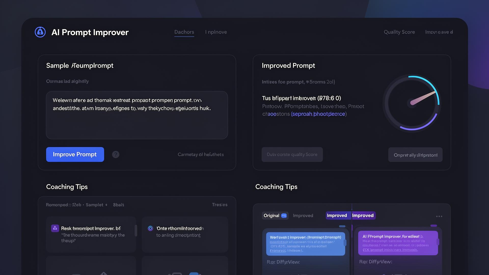

# 🧠 AI Prompt Improver

[](https://lovable.dev)
[](https://react.dev)
[](https://typescriptlang.org)
[](https://tailwindcss.com)
[](https://opensource.org/licenses/MIT)
[](https://prompt-enhancer-grove-181.lovable.app)

A powerful web application that helps you craft better AI prompts through intelligent analysis, real-time coaching, and data-driven recommendations.



## 📑 Table of Contents

- [✨ Features](#-features)
- [🛠️ Tech Stack](#️-tech-stack)
- [🚀 Getting Started](#-getting-started)
- [📖 How to Use](#-how-to-use)
- [📦 Scripts](#-scripts)
- [📋 Changelog](CHANGELOG.md)
- [🤝 Contributing](#-contributing)
- [📜 Code of Conduct](#-code-of-conduct)
- [❓ FAQ](#-faq)
- [🗺️ Roadmap](#️-roadmap)
- [🔗 Links](#-links)

## ✨ Features

### Prompt Enhancement
- **AI-Powered Improvements** — Automatically rewrite and enhance prompts with model-specific optimizations
- **Multi-Model Support** — Optimize for GPT-4, GPT-3.5 Turbo, Claude 3 (Opus/Sonnet/Haiku), Gemini Pro, and Llama 2
- **Quality Scoring** — Real-time quality analysis with actionable breakdown
- **Auto-Categorization** — Prompts are automatically categorized by topic, complexity, and tags after each improvement
- **Customizable Enhancements** — Toggle improvements like high-quality output, structured formatting, step-by-step reasoning, examples, and more

### Prompt Coaching
- **Real-Time Tips** — Get contextual coaching tips (clarity, specificity, context, structure, constraints, examples) as you type
- **One-Click Apply** — Apply individual tips or all at once with AI-powered rewrites
- **Adaptive Prioritization** — Tips are ranked based on historical engagement data so the most useful categories surface first

### Prompt Diff & Version History
- **Side-by-Side Diff View** — Compare original and improved prompts with highlighted changes
- **Version History** — Browse, restore, and manage previous prompt iterations
- **Data Export/Import** — Backup and restore your prompt history as JSON

### Prompt History Search & Filtering
- **Keyword Search** — Full-text search across original and improved prompts in history
- **Category Filters** — Filter history by auto-detected prompt category
- **Complexity Filters** — Filter history by prompt complexity level (simple, moderate, complex)

### A/B Comparison
- **Variant Generation** — Generate multiple improvement variants (Clarity, Detail, Creativity) for any prompt
- **Trade-off Analysis** — Each variant includes a description of its trade-offs
- **One-Click Copy** — Copy any variant to clipboard instantly

### Safety Analysis
- **Prompt Safety Scoring** — Analyze prompts for potential safety concerns
- **Risk Categories** — Identify issues across multiple safety dimensions

### Natural Language Input
- **Conversational Prompt Building** — Describe what you need in plain language and get a structured prompt generated for you

### Prompt Chains
- **Multi-Step Workflows** — Build sequential prompt chains where each step feeds into the next
- **AI-Suggested Chains** — Get AI-generated chain suggestions based on your goal
- **Persistent Storage** — Chains are saved to the database and persist across sessions

### Template Library
- **Built-In Templates** — Curated prompt templates across multiple categories
- **Custom Templates** — Create, edit, and manage your own reusable templates with tags
- **AI-Powered Recommendations** — Get template suggestions based on your prompt content
- **Template Favorites** — Bookmark templates for quick access
- **Template Usage Tracking** — Track which templates are used most frequently

### Analytics Dashboard
- **Usage Statistics** — Track total improvements, copy rate, favorite rate, and quality scores
- **Time-Series Trends** — Visualize prompt, category, model, and template usage over time with interactive charts
- **Coaching Tip Analytics** — Breakdown of tip types by application rate, priority distribution, and engagement
- **Most Applied Tips Leaderboard** — Ranked view of which coaching tip categories users find most valuable
- **Coaching Tip Trend Charts** — Volume and category breakdown of tip interactions over time
- **Milestone Notifications** — Celebrate usage milestones with toast notifications
- **Filterable Date Ranges** — Filter analytics by custom time periods

### Sharing & Collaboration
- **Shareable Links** — Generate public links for improved prompts with optional expiration
- **View Counter** — Track how many times shared prompts have been viewed
- **Public Shared Prompt Page** — Recipients can view original vs improved prompts side by side

### User Management
- **Authentication** — Email-based signup and login with session persistence
- **User Profiles** — Display name, bio, and avatar customization
- **Backup Codes** — Two-factor recovery code support
- **Dark/Light Mode** — System-aware theme toggle with manual override

## 🛠️ Tech Stack

| Layer | Technology |
|-------|-----------|
| **Framework** | React 18 + TypeScript |
| **Build Tool** | Vite 5 |
| **Styling** | Tailwind CSS 3 + tailwindcss-animate |
| **UI Components** | shadcn/ui (Radix UI primitives) |
| **Routing** | React Router DOM v6 |
| **State/Data** | TanStack React Query v5 |
| **Backend** | Lovable Cloud (Supabase) — Auth, Database, Edge Functions, Storage |
| **AI Gateway** | Lovable AI (Gemini 2.5 Flash) |
| **Charts** | Recharts |
| **Icons** | Lucide React |
| **Theming** | next-themes |
| **Forms** | React Hook Form + Zod |
| **Date Utilities** | date-fns |
| **Notifications** | Sonner + Radix Toast |
| **Carousel** | Embla Carousel |
| **QR Codes** | qrcode |
| **Resizable Panels** | react-resizable-panels |

### Edge Functions

| Function | Purpose |
|----------|---------|
| `improve-prompt` | AI-powered prompt improvement with model-specific optimization |
| `analyze-prompt` | Quality scoring and prompt analysis |
| `coach-prompt` | Real-time coaching tip generation |
| `apply-coaching-tip` | Apply a single coaching tip to rewrite the prompt |
| `apply-all-coaching-tips` | Apply all coaching tips at once |
| `ab-compare-prompt` | Generate A/B comparison variants |
| `categorize-prompt` | Auto-categorize prompts by topic, complexity, and tags |
| `structure-prompt` | Convert natural language descriptions into structured prompts |
| `suggest-chain` | AI-generated prompt chain suggestions |
| `analyze-safety` | Prompt safety and risk analysis |
| `recommend-templates` | AI-powered template recommendations |

## 🚀 Getting Started

### Prerequisites
- Node.js v16+

### Installation

```bash
git clone <YOUR_GIT_URL>
cd <YOUR_PROJECT_NAME>
npm install
npm run dev
```

Open [http://localhost:5173](http://localhost:5173) in your browser.

## 📖 How to Use

1. **Sign up / Log in** — Create an account to persist your data
2. **Browse Templates** — Pick a starting template or write your own prompt
3. **Improve** — Select an AI model, toggle enhancements, and click "Improve Prompt"
4. **Coach** — Review real-time coaching tips and apply suggestions
5. **Compare** — Use the diff view or A/B comparison to evaluate variants
6. **Search & Filter** — Use keyword search and category/complexity filters in history
7. **Build Chains** — Create multi-step prompt workflows in the Chains tab
8. **Natural Input** — Describe what you need in plain language and get a structured prompt
9. **Share** — Generate a shareable link for your improved prompt
10. **Analyze** — Visit the Analytics tab to track your usage patterns

## 📦 Scripts

| Command | Description |
|---------|-------------|
| `npm run dev` | Start development server |
| `npm run build` | Production build |
| `npm run preview` | Preview production build |
| `npm run lint` | Run ESLint |

## 🤝 Contributing

Contributions are welcome! Here's how to get started:

1. **Fork** the repository
2. **Clone** your fork locally
   ```bash
   git clone <YOUR_FORK_URL>
   cd ai-prompt-improver
   npm install
   ```
3. **Create a branch** for your feature or fix
   ```bash
   git checkout -b feat/your-feature-name
   ```
4. **Make your changes** — follow the existing code style and conventions
5. **Test** your changes locally with `npm run dev` and `npm run lint`
6. **Commit** using clear, descriptive messages
   ```bash
   git commit -m "feat: add new template category"
   ```
7. **Push** and open a **Pull Request** against `main`

### Guidelines

- Keep PRs focused — one feature or fix per PR
- Follow the existing TypeScript and Tailwind conventions
- Add meaningful comments for complex logic
- Ensure no lint errors before submitting
- Update the README if your change adds or modifies features

## 📜 Code of Conduct

This project follows the [Contributor Covenant Code of Conduct](https://www.contributor-covenant.org/version/2/1/code_of_conduct/).

**Our Pledge:** We are committed to providing a welcoming, inclusive, and harassment-free experience for everyone, regardless of age, body size, disability, ethnicity, gender identity, level of experience, nationality, personal appearance, race, religion, or sexual identity and orientation.

**Expected Behavior:**
- Use welcoming and inclusive language
- Be respectful of differing viewpoints and experiences
- Accept constructive criticism gracefully
- Focus on what is best for the community

**Unacceptable Behavior:**
- Trolling, insulting or derogatory comments, and personal attacks
- Public or private harassment
- Publishing others' private information without permission

Issues or concerns can be reported by opening an issue in the repository.

## ❓ FAQ

<details>
<summary><strong>Is this app free to use?</strong></summary>
Yes! The app is completely free. Sign up with your email and start improving prompts right away.
</details>

<details>
<summary><strong>Which AI models can I optimize my prompts for?</strong></summary>
You can optimize for GPT-4, GPT-3.5 Turbo, Claude 3 (Opus, Sonnet, Haiku), Gemini Pro, and Llama 2. Each model has unique strengths, and the improver tailors suggestions accordingly.
</details>

<details>
<summary><strong>Do I need an API key to use the app?</strong></summary>
No. The app uses Lovable AI on the backend, so you don't need to provide any API keys.
</details>

<details>
<summary><strong>Can I save and reuse my prompts?</strong></summary>
Yes. You can favorite improved prompts, browse your version history, and create custom templates for prompts you use frequently.
</details>

<details>
<summary><strong>How does the coaching feature work?</strong></summary>
As you type, the app analyzes your prompt in real time and surfaces contextual tips across categories like clarity, specificity, context, and structure. You can apply tips individually or all at once.
</details>

<details>
<summary><strong>Can I share my improved prompts with others?</strong></summary>
Yes. Use the share feature to generate a public link with an optional expiration date. Anyone with the link can view the original and improved versions.
</details>

<details>
<summary><strong>Is my data private?</strong></summary>
Yes. All prompts and data are tied to your authenticated account and protected by row-level security. Only you can access your data.
</details>

<details>
<summary><strong>Does the app work on mobile?</strong></summary>
Yes. The interface is fully responsive and works on phones, tablets, and desktops.
</details>

<details>
<summary><strong>How does the Analytics Dashboard work?</strong></summary>
The Analytics Dashboard tracks your prompt improvement activity in real time. It displays total prompts improved, model usage breakdown, category exploration, copy/favorite rates, and average quality scores. You can view time-series trends for prompts, models, categories, and templates, compare the current period against the previous one with percentage change indicators, and explore Coaching Tip Analytics — including application/rejection rates, a "Most Applied Tips" leaderboard, and interaction volume charts over time. Data refreshes every 30 seconds.
</details>

<details>
<summary><strong>What are Prompt Chains?</strong></summary>
Prompt Chains let you build multi-step workflows where each prompt builds on the output of the previous one. You can get AI-suggested chains based on your goal or create your own from scratch.
</details>

<details>
<summary><strong>How does auto-categorization work?</strong></summary>
After each prompt improvement, the app automatically analyzes and categorizes your prompt by topic, complexity level, and relevant tags. These are saved alongside your history and can be used to filter and search your past prompts.
</details>

## 🗺️ Roadmap

Planned features and improvements for future releases:

- [ ] **Team Workspaces** — Collaborate on prompts with shared templates and analytics
- [ ] **API Access** — Programmatic access to prompt improvement and analysis
- [ ] **Browser Extension** — Improve prompts directly from any AI chat interface
- [ ] **Custom Model Profiles** — Define and save custom optimization profiles for any model
- [ ] **Export to Markdown/PDF** — Download improved prompts in formatted documents
- [ ] **Localization** — Multi-language support for the interface and coaching tips

Have a feature request? Open an issue in the repository — we'd love to hear your ideas!

## 🔗 Links

- **Live App**: [prompt-enhancer-grove-181.lovable.app](https://prompt-enhancer-grove-181.lovable.app)
- **Documentation**: [docs.lovable.dev](https://docs.lovable.dev/)

---

Built with ❤️ using [Lovable](https://lovable.dev)
